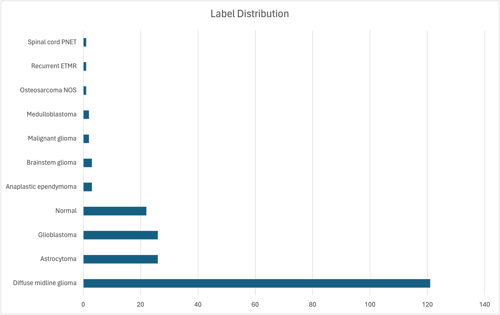

# I-DIMENSION

I-DIMENSION is a project that integrate Dmg/hgg Methylomic EpigeNetic Spatial transcriptomic prOteomic subtyping System.

More specific, we hypothese that developing a methylo-genomic subtyping system predictive of proteomic compoents of each sample will enable the future stratification of patients into subtypes that are indicative of treatment response. Spatial transcriptomics we can predict how ubiquitous our combination approaches informed by proteomics will be and whether the tumor microenvironment may play a major of current and future treatment strategies.

To validate our hypothesis, we list 3 key aims to achieve the goal:

* Aim1

  * Developing a novel methylo-genomic subtyping system for DMG.
* Aim2

  * Identify the key proteomic signatures (drug targets) of each specimen used in the DMG methylo-genomic subtyping system.
* Aim3

  * Identify the spatial heterogeneity of disease and relate this back to the proteomic signatures.

## Data Collection

We have five modalities for the data resource.

* Tumor genomics data

  * WGS (Whole genome sequencing)
  * String data
* DNA methylation data

  * EPIC array
* Chromatin data

  * ATAC-seq
* RNAdata

  * sc-RNA-seq
* Phospho-and proteomic profiling

  * Proteomics

## Exploratory Data Analysis

EDA can help us explore the data's underlying patterns, relationships, and distributions. 

We can leverage visualization and statistical techiques to gain insights and inform subsequent decision.

For image-based data (i.e Xenium), we can group the image tiles by cell types to understand what the tiles look like, and evaluate the quality of annotation generally, Such as to check whether the nucleus of T cell and B cell tiles are small, fibroblast tiles are thin and long.

For the count-based data (i.e sc-RNA-seq), we can visualize the density of gene expression to observe the distribution (NB or Gaussian distribution).

## Data Cleaning

Raw data is rarely perfect to use. It often contains missing values, outliers, and inconsistencies. To solve these issues, we usually need to leverage the automatic correction techniques such as imputation, outlier detection and quality control. To further improve the quality of dataset, we would mannually correct some annoations based on prior knowledge to ensure the data is consistent and ready for analysis.

## Feature Engeering

Raw features may not be a good or suitable input for the model. How to embed the domain knowledge from expert to select, transform and create features that are relevant to the problem at hand is essential. Good feature engeering can significantly improve the model performance and interpretability.

## Model Building

Starting from some simple models (Auto-Encoder, Multi-Layer Perceptron) to have a general ideas that how capable the model is. And then we can add more useful modules and leverage some tricks to enhance the feature extraction. 

There are some examples that we can implement in spatial omics.

* Adding Graph Neural Network to introduce the structure information and utilizing message passing manchism to aggregate neighboring information from surrounding nodes to anchor node.
* Leveraging bottleneck autoencoder to introduce the reconstruction loss to denoising the feature that model extracted.
* Incorporating varational autoencoder to utilize variational inference techniques to approximate the true posterior distribution of latent variables given the observed data.

## Model Evaluation

Model evaluation helps determine if the models are capable of making accurate predictions. We can use various metrics like accuracy and sensitivity for classification, mean squared error and Pearsonr correlation for regression. For some specific case, we need to customise metric to better reflect the model performance. 

Once we developed the model with reasonable performance, we can use cross-validation to unbiasedly measure the model performance. 

## Deployment

If the model meets the desired performance criteria, we can deploy our software on the website to provide user-friendly

service and draw more attention from stakeholders.

## Insights and Action

We can communicate our key findings to stakeholders and decision-makers (patients and medical staff), enabling them to make data-driven decisions. These insights can drive early dignosis, treatment strategy to help patients prevent the disease and prolong the survival time.
